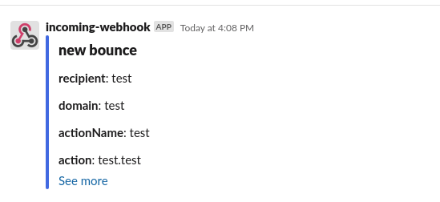

# Simple Logback Slack appender

Integration between [Logback](http://logback.qos.ch/) appender that can push a message to Slack channel using webhook

## Setup

Add dependency to `com.github.nikitachernenko:logback-slack-appender:1.0.0`

Change configuration to our logback settings
Example of Appender configuration to logback.xml. Filtering by "slack" marker
```
<configuration>
  <appender name="SLACK" class="com.github.nikitachernenko.logback.slack.Appender">
   <!-- Slack webhook uri https://api.slack.com/messaging/webhooks -->
    <webhookUri>${WEBHOOK_URI}</webhookUri>
    <!-- Channel that you want to post - default is #general -->
    <channel>mychannel</channel>
    <!-- Colors of different message -->
    <traceColor>#DCDCDC</traceColor>
    <debugColor>#C0C0C0</debugColor>
    <infoColor>#4169E1</infoColor>
    <warnColor>#FF8C00</warnColor>
    <errorColor>#FF0000</errorColor>
    <defaultColor>#F8F8FF</defaultColor> 
  </appender>
    
   <!-- Currently recommended way of using Slack appender -->
  <appender name="ASYNC_SLACK" class="ch.qos.logback.classic.AsyncAppender">
    <filter class="com.github.nikitachernenko.logback.slack.Filter">
        <marker>slack</marker>
    </filter
    <appender-ref ref="SLACK" />
  </appender>

  <root level="info">
    <appender-ref ref="ASYNC_SLACK" />
  </root>
</configuration>
```
example of a slack message
